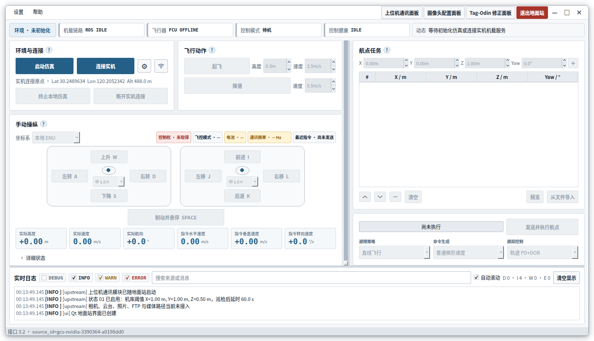
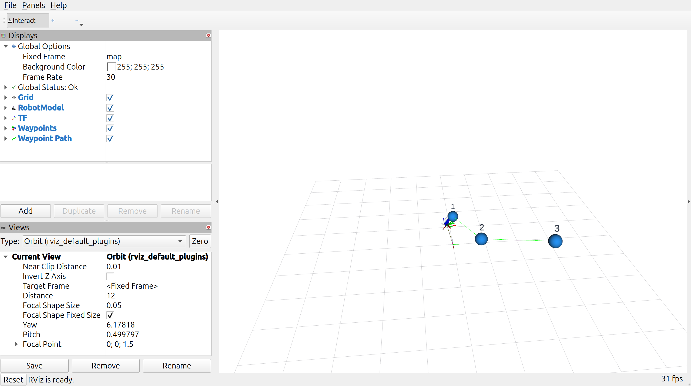
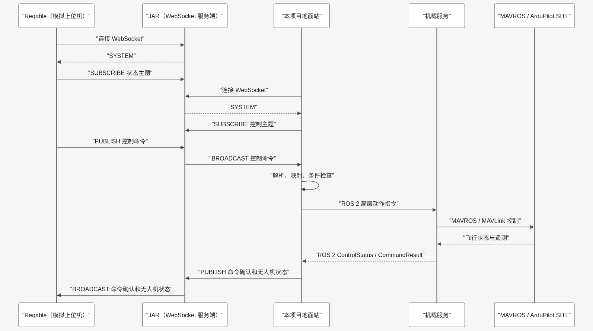
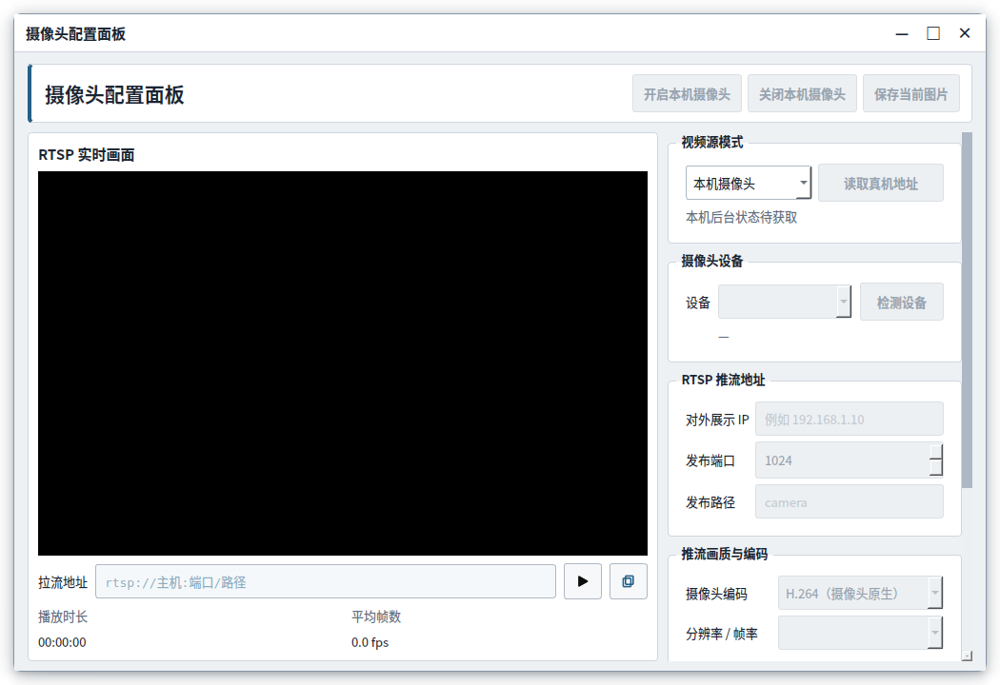

# 无人机自主巡检地面监控与机载协同控制软件

本仓库是“无人机自主巡检地面监控与机载协同控制软件 V1.0”的独立开源代码库。
软件面向基于 ROS 2、MAVROS 与 ArduPilot 的无人机巡检任务，提供地面监控、机载闭环控制、
航点执行、视频采集、上位机通信和视觉定位修正能力。



## 主要能力

| 模块 | 功能 |
| --- | --- |
| 地面监控 | 飞行器状态、控制权、姿态、速度、电池、航点进度与结构化日志显示 |
| 机载协同控制 | 控制租约、命令仲裁、100 Hz PD+DOB 控制、参考轨迹生成和失联保护 |
| 航点巡检 | CSV 导入、航点排序、三维预览、任务执行、到达判定和逐点抓拍 |
| 视频服务 | USB 摄像头单次占用、RTSP 推流、同步录像、人工或任务触发抓拍 |
| 上位机通信 | WebSocket 指令接入、数据映射、状态回传、断线重连和任务终态反馈 |
| 定位修正 | 基于 AprilTag 的 Odin 平面坐标修正、质量门控和原子应用 |
| 仿真验证 | ArduPilot SITL、隔离 ROS 域、MAVROS、RViz 模型与航点可视化 |



## 安全边界

> **实机解锁和起飞只能由操作者人工执行。** 本仓库的安装、构建、环境检查和隔离冒烟验证
> 均不得自动解锁或起飞实机。首次部署、参数变更和台架验证应拆除螺旋桨并持续确认
> `armed=false`。

地面站启动后默认保持 `ROS IDLE`。只有操作者主动启动仿真、连接机载服务或执行被动通信检查时，
系统才创建对应 ROS 会话。视频服务和视觉修正服务与飞控服务保持独立故障域。

## 运行环境

- 地面端：Ubuntu 24.04、ROS 2 Jazzy、Python 3.12、PySide6；
- 机载端：Ubuntu 24.04、ROS 2 Jazzy，推荐 Jetson Orin NX 或同级平台；
- 飞控与通信：ArduPilot、MAVROS、MAVLink；
- 仿真：ArduPilot SITL、MAVProxy、RViz 2；
- 视频：FFmpeg、v4l-utils、MediaMTX 1.20.0；
- 视觉修正：OpenCV、NumPy、PyYAML，以及现场提供的 Odin/相机 ROS 2 驱动。

第三方组件不随本仓库分发，具体许可证和获取边界见
[第三方软件与许可证说明](THIRD_PARTY_NOTICES.md)。

## 快速开始

先安装 ROS 2 Jazzy、MAVROS、ArduPilot SITL、FFmpeg、v4l-utils，并按处理器架构安装
MediaMTX 1.20.0。随后执行：

```bash
git clone https://github.com/LostPatrol/uav-autonomous-inspection-control.git
cd uav-autonomous-inspection-control
./setup_ground_station.sh
./start_ground_all.sh
```

只检查环境、不创建飞行会话：

```bash
./start_ground_all.sh --check-environment
```

进入界面后可点击“启动仿真”运行本地 SITL。仿真固定使用非零隔离域，不与实机 ROS 域混合。
完整安装步骤、界面操作、机载部署、视频配置、视觉修正和故障排查见
[软件详细开发与使用手册](软件详细开发与使用手册.md)。

## 软件架构

系统采用“地面站—机载服务—飞控/传感器”分层架构。地面站只发送高层意图；持续控制、航点推进、
保护状态机和 MAVROS 输出由机载服务统一负责。上位机通信、视频和视觉修正均通过明确接口接入，
其故障不会绕过飞行控制权威。



## 代码结构

```text
uav-autonomous-inspection-control/
├── ground_station.py              # 地面站入口
├── ground_station_core/           # Qt 界面、ROS 客户端与上位机通信
├── src/
│   ├── guided_interfaces/         # 地面—机载共享高层接口
│   ├── correction_interfaces/     # 视觉修正接口
│   ├── onboard_control/           # 机载控制、任务与保护状态机
│   └── guided_sim/                # SITL/RViz 模型与可视化
├── video_service/                 # 独立视频采集、推流、录像和抓拍
├── correction_service/            # AprilTag-Odin 修正服务与 extnav 适配
├── start_drone/                   # 机载组件启动与环境发现
├── examples/                      # 航点 CSV 示例
├── assets/                        # 手册与首页图片
└── 软件详细开发与使用手册.md       # 统一开发、部署与使用文档
```

仓库不包含历史报告、代理任务、实验过程文件、第三方演示、预编译媒体服务、设备厂商 SDK、
测试源码或构建产物。

## 构建机载软件

```bash
./build_onboard_control.sh
```

执行依赖检查、Release 构建和 localhost 隔离冒烟验证：

```bash
./build_onboard_control.sh --verify
```

隔离冒烟验证不会连接 MAVROS 或实机，不会发布姿态设定值，也不会产生解锁或起飞命令。

## 视频面板

```bash
./.venv/bin/python video_service/camera_panel.py
```



面板可管理本机摄像头、查看机载 RTSP 或打开指定 RTSP 地址。关闭面板不会自动停止后台录像；
视频服务故障也不会停止、重启或改变飞控任务。

## 版本与授权

- 软件名称：无人机自主巡检地面监控与机载协同控制软件；
- 当前版本：V1.0；
- 著作权人：北京航空航天大学；
- 开源许可证：木兰宽松许可证第2版，SPDX 标识为 `MulanPSL-2.0`。

许可证正文见 [LICENSE](LICENSE)。第三方组件仍按各自许可证使用，本项目名称及北京航空航天大学
名称、简称、校名和标识不因源代码许可证而获得商标或其他使用授权。
