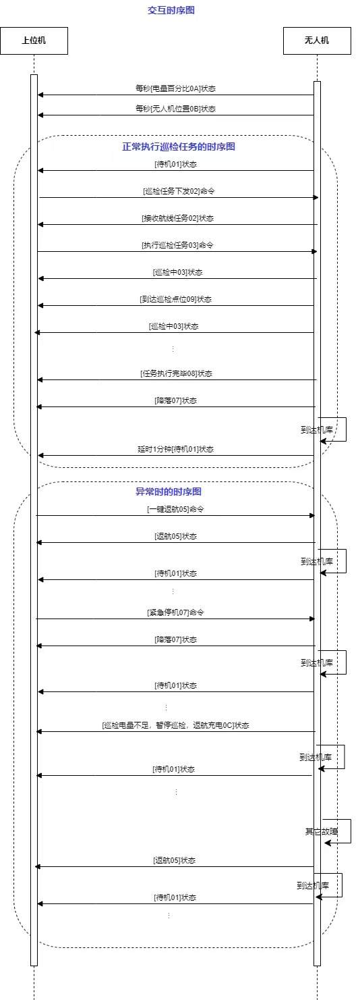

# 无人机自主巡检地面监控与机载协同控制软件 V1.0

## 软件详细开发与使用手册

| 项目 | 内容 |
| --- | --- |
| 软件全称 | 无人机自主巡检地面监控与机载协同控制软件 |
| 版本号 | V1.0 |
| 著作权人 | 北京航空航天大学 |
| 软件类型 | 无人机地面监控、机载协同控制与巡检任务软件 |
| 主要平台 | Ubuntu 24.04、ROS 2 Jazzy、ArduPilot、MAVROS |
| 文档版本 | 1.0 |
| 编制日期 | 2026年9月9日 |

## 1. 引言

### 1.1 编写目的

本手册统一说明软件的功能、架构、安装、配置、使用、部署与维护方法，供软件使用人员、
机载系统集成人员、维护人员和后续开发人员使用。仓库内不再为地面站、视频、机载控制和
视觉修正分别维护零散说明文档；所有正式操作说明以本手册为准。

### 1.2 软件目标

软件用于连接地面操作者、巡检上位机、机载计算机和 ArduPilot 飞控，形成任务下发、状态监控、
机载闭环控制、航点巡检、视频取证和定位修正的一体化链路。其核心设计目标为：

1. 地面端只表达高层意图，持续飞行控制由机载端统一执行；
2. 仿真与实机运行环境严格隔离，切换时重建 ROS 2 上下文；
3. 飞控、视频和视觉修正采用相互独立的服务生命周期；
4. 所有任务命令具有来源、序号、有效期和控制租约约束；
5. 状态、日志和任务终态均可追踪，不以进程启动代替功能就绪；
6. 在地面站失联、状态超时、输出异常或控制冲突时进入明确保护流程。

### 1.3 重要安全声明

实机解锁和起飞只能由操作者人工执行。安装脚本、构建脚本、环境检查和隔离冒烟验证均不得
自动解锁或起飞实机。首次部署、参数调整、串口变更和机载服务更新必须在拆除螺旋桨、
飞控未解锁的条件下进行。

本软件不是飞控固件，不替代飞控自身的姿态稳定、硬件失效保护和遥控器接管机制。任何实机使用
都应经过独立安全评审、场地许可和分阶段台架验证。

## 2. 系统组成

### 2.1 总体架构

系统由地面站、机载控制服务、MAVROS/ArduPilot、视频服务、视觉修正服务和可选上位机组成。


各层职责如下：

| 层级 | 主要职责 | 禁止承担的职责 |
| --- | --- | --- |
| 上位机 | 发送业务任务、接收状态和任务结果 | 直接发布 MAVROS 姿态设定值 |
| 地面站 | 界面交互、航点编辑、状态展示、租约申请和高层指令 | 保存 100 Hz 连续控制闭环 |
| 机载控制服务 | 命令仲裁、航点推进、参考生成、PD+DOB、保护状态机 | 自动替代操作者确认实机解锁/起飞 |
| MAVROS | ROS 2 与 MAVLink 协议转换 | 决定业务任务完成条件 |
| ArduPilot | 飞控姿态稳定、模式管理、传感器融合与执行机构控制 | 管理地面站业务界面 |
| 视频服务 | 摄像头、RTSP、录像、抓拍和状态发布 | 改变飞行任务终态 |
| 视觉修正服务 | AprilTag 检测、同步、质量门控和 Odin 平面修正 | 在质量不合格时强制写入修正 |

### 2.2 地面站

地面站采用 PySide6/Qt Widgets 开发。启动后默认处于“环境未初始化、ROS IDLE、飞行器离线”状态，
不会立即创建 DDS 参与者或发送控制命令。主界面包含环境连接、飞行动作、手动操纵、航点任务、
状态摘要、日志以及三个独立子面板入口。


### 2.3 机载控制服务

`onboard_control` 是飞行控制权威。它以 100 Hz 更新控制器，以 10 Hz 发布聚合状态，统一处理：

- 控制租约和 5 Hz 心跳；
- 起飞、降落、悬停、手动运动和航点任务；
- 位置阶跃、二阶滤波、梯形速度和限加加速度 S 曲线参考；
- 位置 PD+DOB 与轨迹 PD+DOB；
- 航点位置、速度和持续时间判定；
- 位姿超时、FCU 状态超时、失联保护和设定值发布冲突；
- 视频自动启停和航点抓拍事件。

### 2.4 视频服务

视频服务只打开一次 V4L2 摄像头，由 FFmpeg 将原生 H.264 或 MJPEG 同时交给 MediaMTX 发布 RTSP
并封装录像。截图从本机 RTSP 获取，不会再次占用摄像头。视频服务与机载控制使用独立进程和
独立 systemd 单元；摄像头或磁盘故障不能停止飞控服务。


### 2.5 视觉修正服务

视觉修正服务在显式任务期间开启下视相机并订阅 Odin 高频里程计。服务组合相机内参、
`T_imu_camera` 外参、Tag 世界位姿与时间同步样本，估计 Odin 到世界坐标系的 `x/y/yaw` 修正。
修正只有在样本数、时间跨度、重投影误差、倾角、标准差和极差全部通过后才允许应用。

## 3. 目录和源码说明

| 路径 | 内容 |
| --- | --- |
| `ground_station.py` | 地面站主入口、运行环境加载和 Qt 应用创建 |
| `ground_station_core/` | 状态模型、ROS 客户端、进程管理、Qt 界面和上位机通信 |
| `src/guided_interfaces/` | 飞行控制和视频业务共享消息、服务接口 |
| `src/correction_interfaces/` | 视觉修正消息与服务接口 |
| `src/onboard_control/` | C++ 机载控制器、任务状态机、配置和部署脚本 |
| `src/guided_sim/` | RViz 模型、航点标记、TF 桥和仿真可视化启动文件 |
| `video_service/` | 地面摄像头面板、媒体后端和机载视频节点 |
| `correction_service/` | 修正面板、检测估计节点、配置和 extnav 适配文件 |
| `start_drone/` | MAVROS、Odin、extnav 和链路组件的发现与启动脚本 |
| `examples/` | 标准航点 CSV 示例 |
| `assets/` | 首页和手册所用界面截图、架构图和时序图 |

仓库不保存构建目录、虚拟环境、运行日志、录像、图片结果、设备 SDK、第三方二进制、实验过程文件、
代理任务、历史报告或测试源码。

## 4. 环境要求

### 4.1 地面端

推荐环境为 Ubuntu 24.04、ROS 2 Jazzy 和 Python 3.12。应预先安装：

- ROS 2 Jazzy Desktop；
- MAVROS、MAVROS 消息和 GeographicLib 数据；
- ArduPilot 源码及可运行的 `sim_vehicle.py`；
- `colcon`、CMake、G++ 和 Python 虚拟环境支持；
- FFmpeg、ffprobe、v4l-utils；
- 与处理器架构匹配的 MediaMTX 1.20.0。

软件也保留对 Ubuntu 22.04 / ROS 2 Humble 的兼容发现逻辑，但新的正式部署应优先统一到
Ubuntu 24.04 / Jazzy，避免跨 ROS 发行版通信带来的兼容风险。

### 4.2 机载端

推荐使用 Jetson Orin NX 或具有相当算力的 Ubuntu 24.04 aarch64 平台。除 ROS 2、MAVROS 和本仓库外，
还需要现场已经验证的：

- 飞控串口设备；
- Odin ROS 2 驱动工作区；
- extnav ROS 2 工作区；
- 下视相机 ROS 2 驱动工作区；
- ARM64 FFmpeg、v4l-utils 和 MediaMTX。

不得把 x86_64 地面机的 `build/`、`install/` 或 MediaMTX 二进制复制到 ARM64 机载计算机。

### 4.3 网络

地面端与机载端必须位于互通网络。Jazzy 默认使用：

```bash
export ROS_DOMAIN_ID=0
export ROS_AUTOMATIC_DISCOVERY_RANGE=SUBNET
```

本地仿真固定使用 ROS 域 231 和仅限本机发现。实机使用 ROS 域 0。不要同时让仿真和实机端点进入
同一 DDS 图。若组播发现不可用，可在 `ground_station.env.example` 的基础上设置经人工确认的
`ROS_STATIC_PEERS`。

## 5. 地面站安装

### 5.1 获取源码

```bash
git clone https://github.com/LostPatrol/uav-autonomous-inspection-control.git
cd uav-autonomous-inspection-control
```

### 5.2 安装系统媒体工具

```bash
sudo apt update
sudo apt install -y ffmpeg v4l-utils ca-certificates curl
```

MediaMTX 不随仓库分发。下载 1.20.0 官方发布包时必须选择当前处理器架构，并校验发布文件摘要，
随后将可执行文件安装为：

```text
/usr/local/bin/mediamtx
```

安装后检查：

```bash
file /usr/local/bin/mediamtx
/usr/local/bin/mediamtx --version
```

### 5.3 执行统一安装

```bash
./setup_ground_station.sh
```

该脚本完成以下工作：

1. 自动发现 Humble 或 Jazzy；
2. 检查编译器、ROS 2 包和媒体命令；
3. 创建带系统 ROS 包访问能力的项目 `.venv`；
4. 安装 PySide6、MAVProxy、websockets 和兼容依赖；
5. 以 Release 模式构建五个本项目 ROS 2 包；
6. 加载构建结果并执行地面站环境检查。

脚本不会调用飞控串口、启动 MAVROS、连接实机、解锁或起飞。

### 5.4 启动与退出

```bash
./start_ground_all.sh
```

只检查环境：

```bash
./start_ground_all.sh --check-environment
```

退出时应使用主界面“退出地面站”或窗口关闭按钮。地面站会清理本次启动的本机 SITL、MAVROS、
机载仿真节点和 RViz，但不会停止系统中与本次会话无关的 ROS 进程。

## 6. 地面站操作

### 6.1 启动本地仿真

1. 确认 ArduPilot `sim_vehicle.py` 可用；
2. 点击“启动仿真”；
3. 等待状态栏显示 FCU 已连接、本地位置有效和控制权已取得；
4. 使用界面中的起飞、手动操纵、航点和降落功能；
5. 完成后点击“终止本地仿真”。

仿真中的起飞操作只作用于 localhost 隔离环境，不授权任何实机操作。

### 6.2 连接实机

主界面提供两个不同入口：

- Wi-Fi 图标：只订阅机载状态和日志，不申请控制租约，不发送心跳或飞行命令；
- “连接实机”：建立正式 ROS 会话、申请控制租约，并按人工确认值设置 GPS/EKF 原点。

连接实机前必须确认螺旋桨状态、飞控串口、遥控器接管能力、网络域、GPS 原点和现场安全条件。
任何解锁与起飞均由操作者在明确确认后人工执行。

### 6.3 手动操纵

默认键位为：

| 动作 | 按键 |
| --- | --- |
| 上升、下降 | `W`、`S` |
| 前进、后退 | `I`、`K` |
| 左移、右移 | `J`、`L` |
| 左转、右转 | `A`、`D` |
| 制动并悬停 | 空格键 |

键盘和界面按钮使用同一安全门控。数值框、搜索框、日志或按钮获得输入焦点时，飞行快捷键自动停用。
手动坐标系可选本地 ENU 或机体坐标，切换前应确认操作者预期方向。

### 6.4 航点任务

航点采用绝对本地 ENU 坐标，CSV 格式为：

```csv
index,x,y,z,yaw
1,0.0,0.0,2.0,0.0
2,5.0,0.0,2.0,0.0
```

每次最多 256 个航点。导入流程先完整校验，再由操作者确认是否替换当前列表。执行前可选择：

- 飞行策略：当前生产实现为直线飞行；
- 参考生成：位置阶跃、二阶滤波、梯形速度或限加加速度 S 曲线；
- 跟踪控制：位置 PD+DOB 或轨迹 PD+DOB。

默认组合为梯形速度与轨迹 PD+DOB。任务必须从稳定悬停开始；速度不满足时，机载端先悬停并按周期
重判。航点进入位置容差但速度过大时不会立即判定到达。


### 6.5 日志

实时日志分为 `DEBUG`、`INFO`、`WARN` 和 `ERROR`。筛选器只影响显示，不删除原事件。
出现以下事件时应停止继续操作并排查：

- 同名机载端点或多个姿态设定值发布者；
- `armed=true` 与现场预期不符；
- FCU、本地位姿或控制心跳超时；
- 推力语义未确认；
- 坐标原点不匹配；
- 输出出现非有限值；
- 航点启动或到达连续失败。

## 7. 上位机通信

地面站随主程序启动 WebSocket 适配器，默认地址和客户端编号位于 `ground_station.env.example`。
适配器负责连接、订阅、数据映射、条件检查、任务触发、状态投影和终态反馈。



WebSocket 断线不会销毁已建立的 ROS 或仿真会话。自动返航等上位机动作必须同时满足连接状态、
任务状态和机载控制权条件，不能仅凭文本消息绕过地面站门控。

## 8. 视频功能

### 8.1 地面摄像头面板

```bash
./.venv/bin/python video_service/camera_panel.py
```

面板支持本机摄像头、机载摄像头和指定 RTSP 三种来源。切换来源或关闭面板只停止预览，
不会自动停止正在运行的后台推流或录像。

### 8.2 本机视频服务命令

```bash
./.venv/bin/python video_service/camera_service.py probe
./.venv/bin/python video_service/camera_service.py start
./.venv/bin/python video_service/camera_service.py status
./.venv/bin/python video_service/camera_service.py snapshot
./.venv/bin/python video_service/camera_service.py stop
./.venv/bin/python video_service/camera_service.py shutdown
```

本机配置保存在用户配置目录，运行文件位于 XDG runtime，日志位于用户状态目录。录像先写入临时文件，
正常停止封装后再原子改名，避免把未完成文件误认为有效录像。

### 8.3 机载视频配置

`video_service/config/camera.conf` 配置设备、编码、分辨率、帧率、RTSP 和存储目录；
`video_service/config/lens.conf` 配置曝光和增益。更换摄像头时先执行：

```bash
v4l2-ctl --list-devices
v4l2-ctl --list-formats-ext -d /dev/v4l/by-id/<摄像头>-video-index0
```

只有摄像头真实声明的编码、分辨率和帧率组合才允许写入生产配置。默认 H.264 1920×1080@60
仅代表已验证设备的基线，不是所有摄像头的通用能力。

### 8.4 机载视频部署

```bash
./video_service/deploy/install_onboard_video_service.sh
```

安装器创建独立 `video-service.service`，保留既有现场配置，并默认保持摄像头关闭。手工控制命令为：

```bash
./start_onboard_video.sh
./stop_onboard_video.sh
./stop_onboard_video.sh --restart
```

视频单元不得添加飞控服务的 `Requires=`、`PartOf=` 或 `BindsTo=`。

## 9. 机载控制部署

### 9.1 构建

在机载计算机的仓库根目录执行：

```bash
./build_onboard_control.sh
```

执行完整生产验证：

```bash
./build_onboard_control.sh --verify
```

`--verify` 依次检查依赖、执行 Release 构建并在 ROS 域 231 运行无 MAVROS 隔离冒烟验证。
冒烟验证要求接口版本为 3.2、FCU 未连接、`armed=false`，并确认姿态设定值消息为零。

### 9.2 现场配置

机载控制读取：

```text
/etc/ros2-ardupilot/onboard.env
```

至少需要核对：

```bash
ONBOARD_ROS_DISTRO=jazzy
ONBOARD_WORKSPACE=/home/<机载用户>/uav-autonomous-inspection-control
MAVROS_FCU_DEVICE=/dev/serial/by-id/<已确认飞控设备>
MAVROS_FCU_BAUD=460800
ODIN_OVERLAY_SETUP=/home/<机载用户>/<Odin工作区>/install/setup.bash
EXTNAV_OVERLAY_SETUP=/home/<机载用户>/<extnav工作区>/install/setup.bash
ROS_DOMAIN_ID=0
ROS_AUTOMATIC_DISCOVERY_RANGE=SUBNET
```

存在多个串口或多个 overlay 候选时，启动器必须拒绝猜测。只能在人工核对接线和安装来源后写入固定值。

### 9.3 安装 systemd 服务

```bash
./src/onboard_control/deploy/install_onboard_service.sh
```

安装器构建机载软件、生成首次现场环境文件、安装 `ros2-ardupilot-onboard.service` 并启用开机自启。
若服务已经处于活动状态，安装器会拒绝自动覆盖和重启，避免在未知飞行状态下改变运行代码。

检查和手工启动：

```bash
./start_onboard_control.sh --check
./start_onboard_control.sh
./stop_onboard_control.sh
```

启动脚本监督 MAVROS、Odin、extnav 和 onboard_control 四个主要进程；任一主要进程异常退出时，
脚本会清理其余进程并以失败状态退出，由 systemd 按策略重启整组服务。

## 10. AprilTag-Odin 修正

### 10.1 配置文件

| 文件 | 含义 |
| --- | --- |
| `intrinsics.yaml` | 下视相机内参和畸变参数 |
| `extrinsics.yaml` | 相机到 Odin IMU 的外参 `T_imu_camera` |
| `tag_pose.csv` | Tag 编号、世界位置、偏航和边长 |
| `general_settings.yaml` | 话题、同步、质量门和超时 |
| `camera.conf` | 下视相机设备、模式和图像话题 |
| `lens.conf` | 与标定一致的 UVC 参数 |

内外参和 Tag 世界位姿必须针对实际安装重新标定或测量。未确认 Tag 世界姿态时，只允许使用
`apply=false` 验证识别、同步和离散程度，不得把候选结果写入飞控定位链。

### 10.2 部署

先备份并安装 extnav 适配：

```bash
./correction_service/deploy/install_extnav_correction.sh
```

再安装独立修正服务：

```bash
./correction_service/deploy/install_correction_service.sh
```

修正服务只在任务期间占用相机和 400 Hz Odin 订阅。任务失败、服务退出或修正失效时，extnav
继续按恒等变换转发原始 Odin 数据；已确认的修正只由 extnav 以会话号和修订号原子维护。

## 11. 关键配置

### 11.1 控制参数

`src/onboard_control/config/control.yaml` 是连续控制和保护阈值的唯一生产配置。重要项目包括：

- `control_frequency`：主控制频率，默认 100 Hz；
- `pose_timeout_seconds`：位姿/速度最大断流时间；
- `link_loss_land_timeout_seconds`：租约丢失后悬停转降落时间；
- `waypoint_tolerance`：航点三维位置容差；
- `waypoint_arrival_speed_tolerance`：航点到达速度门；
- `hover_wn_*`、`hover_zeta_*`：位置 PD 参数；
- `dob_L_*`：扰动观测器带宽；
- `trajectory_*`：轨迹 PD+DOB 独立参数；
- `trapezoidal_*`、`s_curve_*`：参考轨迹限制；
- `hover_throttle`：仅作启动回退，运行时由飞控 `MOT_THST_HOVER` 覆盖；
- `max_tilt_degrees`：最大控制倾角。

控制参数必须先在 SITL 验证，再进入无桨台架，最后才可由操作者安排实飞。不得把某架飞机的
悬停油门或未经确认的参数硬编码为所有设备的通用值。

### 11.2 接口版本

飞行控制线协议版本为 3.2。`guided_interfaces`、`onboard_control`、地面站源码和机载安装产物
必须同步更新。若状态中接口版本不一致，地面站应拒绝进入正常控制流程。

主要命名空间包括：

| 命名空间 | 内容 |
| --- | --- |
| `/onboard_control` | 控制租约、心跳、飞行动作、航点和聚合状态 |
| `/video_service` | 视频控制、抓拍、状态、结果和独立启停服务 |
| `/correction_service` | 修正启动、停止、状态和结果 |
| `/extnav` | 修正应用服务和 extnav 修正状态 |
| `/mavros` | 飞控状态、位置、模式、参数和姿态设定值 |

## 12. 安全与故障处理

### 12.1 控制租约

所有高层输入包含来源标识、单调序号、时间戳和有效期。同一时刻只允许一个租约持有者。
首次租约以两端相对时间建立基准，不要求地面站与飞机绝对时钟完全一致。重复、乱序、过期或非持权
命令均被拒绝。

### 12.2 失联保护

租约丢失后，机载端立即抓取当前位置并悬停；超过配置时限仍未恢复时请求 LAND。
飞控切离 GUIDED、位置或 FCU 状态超时、输出非有限、推力语义失效和设定值冲突也属于保护条件。

### 12.3 起降语义

起飞由 ArduPilot GUIDED/arm/takeoff 完成安全离地，稳定后切换到机载连续控制。LAND 交给
ArduPilot，只有实际解除武装才作为可靠终态，不能把模式切换应答当作已经落地。

### 12.4 视频故障隔离

视频服务缺失、卡死、相机占用、RTSP 失败或磁盘写入失败只进入视频状态和抓拍结果，不能改变航点、
降落或飞行任务终态。飞控服务和视频服务不得相互声明强生命周期依赖。

## 13. 常见问题

### 13.1 地面站提示 ROS 包缺失

确认已加载正确 ROS 发行版，并重新执行：

```bash
./setup_ground_station.sh
```

不要同时 source 多个 ROS 发行版或旧工作区。使用 `ros2 pkg prefix <包名>` 检查实际来源。

### 13.2 找不到 ArduPilot SITL

地面站依次检查环境变量、当前 `PATH`、仓库同级目录、用户目录、`/opt` 和 `/usr/local/src`。
可通过 `GROUND_STATION_SIM_VEHICLE` 指定已经确认的 `sim_vehicle.py`。

### 13.3 MAVROS 在线但地面站不可控制

依次检查接口版本、控制租约、FCU 模式、本地位置、消息频率、推力语义、重复端点和 ROS 域。
“能看到 `/mavros/state`”只证明部分通信存在，不等于机载控制服务已经就绪。

### 13.4 视频无法播放

检查摄像头模式、MediaMTX 架构、8554 端口、RTSP 地址、FFprobe 结果和摄像头占用者：

```bash
file /usr/local/bin/mediamtx
/usr/local/bin/mediamtx --version
ffprobe -v error rtsp://<地址>:8554/camera
fuser /dev/v4l/by-id/<摄像头>-video-index0
```

### 13.5 修正服务不收敛

检查 Tag 是否唯一可见、边长是否正确、内外参是否匹配当前分辨率、时间匹配差是否超限、
重投影误差和样本离散度是否通过。不得通过关闭质量门伪造可用修正。

## 14. 开发与维护

### 14.1 生产构建

```bash
source /opt/ros/jazzy/setup.bash
colcon build --packages-select \
  guided_interfaces correction_interfaces onboard_control guided_sim correction_service \
  --cmake-args -DCMAKE_BUILD_TYPE=Release
```

构建完成后：

```bash
source install/setup.bash
./.venv/bin/python ground_station.py --check-environment
./build_onboard_control.sh --verify
```

### 14.2 版本维护

修改共享接口时必须同步更新：

1. `src/guided_interfaces/package.xml`；
2. `src/onboard_control/package.xml`；
3. 地面站 `INTERFACE_VERSION`；
4. 机载部署产物；
5. 本手册中的接口版本说明。

### 14.3 发布检查

每次发布至少检查：

- 仓库中不存在 `.venv/`、`build/`、`install/`、`log/` 和缓存；
- 不存在录像、抓拍、密钥、现场账号和逐机私有配置；
- 所有软件包许可证均为 `MulanPSL-2.0`；
- `LICENSE`、`THIRD_PARTY_NOTICES.md` 与实际依赖一致；
- README 和本手册中的版本、名称、著作权人一致；
- 隔离冒烟验证报告 `armed=false` 且姿态设定值为零；
- 远端 `main` 与待发布提交一致。

## 15. 著作权与开源说明

本仓库的软件本体、配置和中文文档由北京航空航天大学作为著作权人，以木兰宽松许可证第2版
开源。第三方依赖由用户单独安装，不包含在本仓库的著作权声明和开源授权范围内，详情见
`THIRD_PARTY_NOTICES.md`。

### 15.1 代码来源与独立仓库边界

本仓库以全新的 Git 历史建立，不继承此前开发仓库的分支、提交、议题、开发报告、测试材料或
演示目录。纳入本仓库的功能源码是在后续项目开发中形成的地面站、机载控制、视频、视觉修正和
接口实现；早期上游项目的 SITL/MAVROS 配置包、脚本和英文文档未纳入本仓库。ROS 2、MAVROS、
ArduPilot 等仅作为外部依赖单独安装。

独立 Git 历史本身不产生或转移著作权。软件登记和对外发布前，应由经办人归档参与人员的职务开发
证明、著作权转让或许可文件，以及北京航空航天大学对公开发布和许可证选择的授权。若以后发现
某个文件仍含第三方受保护代码，应保留其原有声明并按对应许可证处理，不能用重写提交历史的方式
消除原权利人的权利。

### 15.2 软件登记材料基线

用于软件著作权登记的源程序、说明书、版本号和著作权人信息应从同一发布提交生成。提交前至少应：

1. 固定发布提交哈希和打包日期，不以仍在变化的工作目录直接制作材料；
2. 确认申请表、源程序页眉、说明书封面中的软件全称、简称和 V1.0 版本完全一致；
3. 仅选取本仓库软件本体源程序，不把外部依赖、构建产物、日志、测试或设备厂商文件计入源程序；
4. 对参与人员和单位权属文件进行书面核验，并由北京航空航天大学有权部门确认最终申报口径；
5. 将登记提交包、对应 Git 提交和权属证明一并留档，以便后续版本追溯。

木兰宽松许可证允许复制、使用、修改和分发本软件，但要求分发时提供许可证副本并保留软件中的
版权、专利、商标和免责声明。许可证不授予北京航空航天大学名称、简称、校名、校徽或其他标识的
商标及类似权利。
